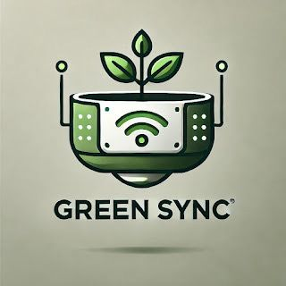
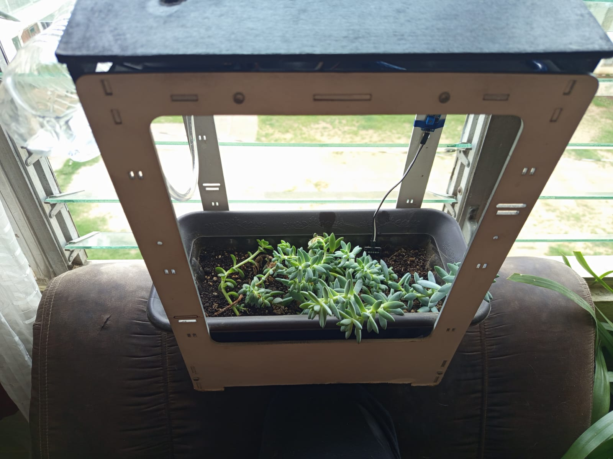
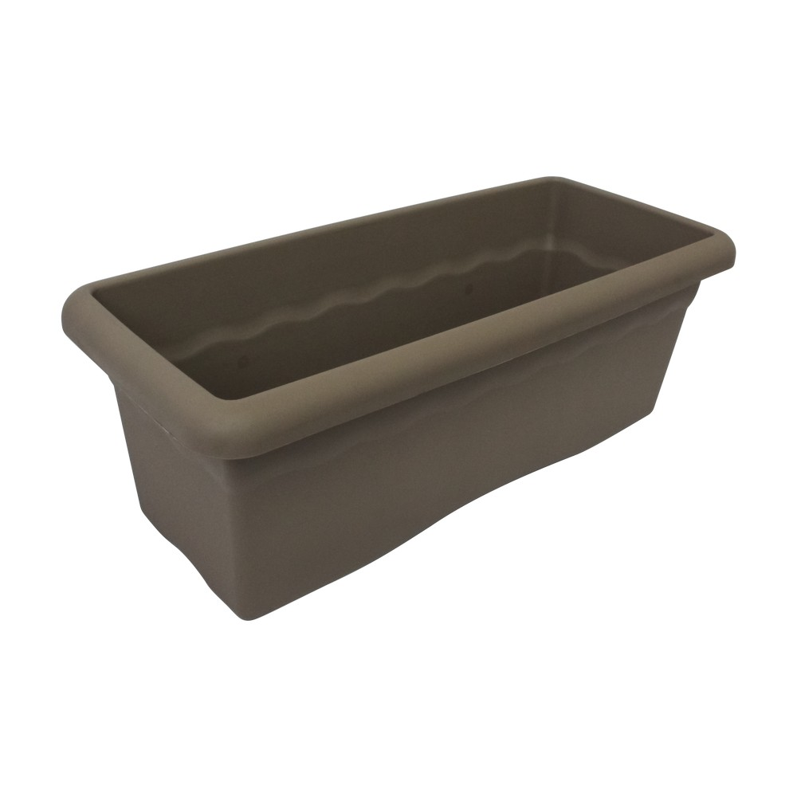

<html lang="es">

<head>
    <meta charset="UTF-8">
    <meta name="viewport" content="width=device-width, initial-scale=1.0">
    <title>GREEN SYNC - Mi Tienda</title>
    <link href="https://fonts.googleapis.com/css2?family=Poppins:wght@40400;600&display=swap" rel="stylesheet">
    
</head>

<body>
    <header>
        

            <h1>GREEN SYNC</h1>
            
        

    </header>
    <nav>
        <a href="#inicio">Inicio</a>
        <a href="#nosotros">Nosotros</a>
        <a href="#productos">Productos</a>
        <a href="#contacto">Contacto</a>
        <a href="#carrito">Carrito</a>
    </nav>

    <section id="inicio">
        <h2>Bienvenido a nuestra tienda</h2>
        
Hemos desarrollado una maceta inteligente capaz de regar automáticamente tus plantas, llevar un control de la
            temperatura en la que se encuentra y poseer luces UV, todo lo esencial para el cuidado de tus plantas.

        
Nuestra maceta inteligente está equipada con sensores de humedad tanto en el suelo como en el ambiente, una
            bomba de agua para el riego de tus plantas, y luces UV, tecnología que ayuda a crecer tus plantas. Todo
            esto es controlado por Arduino Uno, programado para ayudarte con el cuidado de tus plantas e incluso
            cultivos.

        
Adicionalmente, creamos una aplicación móvil para que puedas ver el monitoreo de tus plantas, para así
            conectarte con lo que más amas.

        
Todo esto lo hemos desarrollado con un solo fin: ayudarte y cuidar lo que más amas.

    </section>

    <section id="nosotros">
        <h2>Nosotros</h2>
        <h3>Visión</h3>
        
Ser un referente en la innovación de sistemas inteligentes de cuidado de plantas, utilizando tecnología
            avanzada para crear entornos óptimos y automatizados que mejoren la eficiencia en el cultivo y la
            jardinería, contribuyendo al crecimiento saludable y sostenible de las plantas.

        <h3>Misión</h3>
        
Automatizar el cuidado de las plantas mediante el uso de sensores y actuadores, proporcionando un entorno
            controlado que garantice el monitoreo de la humedad, temperatura, riego y luz adecuada para optimizar el
            crecimiento y bienestar de las plantas.

    </section>

    <section id="productos">
        <h2>Nuestros Productos</h2>
        

            <h3>Maceta Inteligente</h3>
            
            
Q.350.00

            <button onclick="agregarAlCarrito('Maceta Inteligente', 350)">Agregar al carrito</button>
        

        

            <h3>Macetas</h3>
            
            
Q.65.00

            <button onclick="agregarAlCarrito('Macetas Tradicionales', 75)">Agregar al carrito</button>
        

    </section>

    <section id="carrito">
        <h2>Carrito de Compras</h2>
        <ul id="lista-carrito"></ul>
        
<strong>Total:</strong> Q0

    </section>

    <section id="contacto">
        <h2>Contacto</h2>
        
Escríbenos a: <a href="mailto:GreenSync@gmail.com"
                style="color: #4CAF50; text-decoration: none;">GreenSync@gmail.com</a>

        
Síguenos en redes sociales:

        

            <a href="https://www.facebook.com/share/19BwK5Vm8S/?mibextid=wwXIfr" target="_blank"
                style="color: #3b5998; text-decoration: none; margin-right: 15px;">Facebook</a>
            <a href="https://www.instagram.com/greensync_/profilecard/?igsh=MTYxcnR6ZXNpNDZrZw==" target="_blank"
                style="color: #e4405f; text-decoration: none;">Instagram</a>
        

    </section>

    <footer>
        
&copy; 2025 GREEN SYNC - Mi Tienda Verde. Todos los derechos reservados.

    </footer>

    
</body>

</html>
